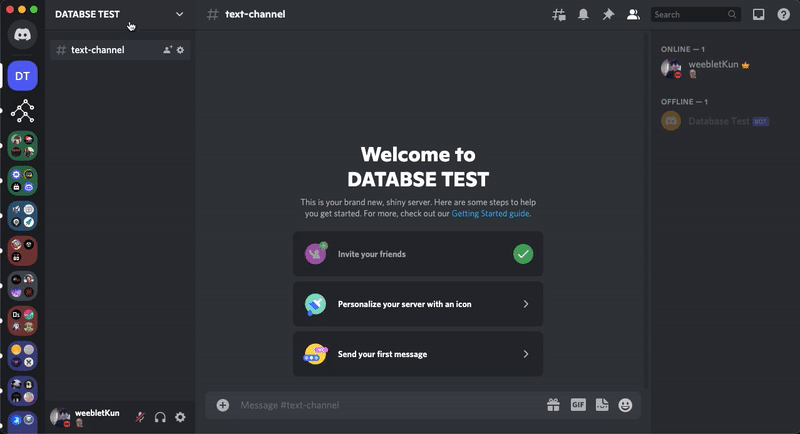

# Discord Database

A CRUD (Create Read Update Delete) database for python Discord bot developers. All data is stored in key-value pairs directly on discord in the form of text messages, in the text channel that you specify.

## Installation

```bash
pip3 uninstall discord.py
```

```bash
pip3 install DiscordDatabase
```

## Getting Started

### Import libraries

```python
import discord
from discord.ext import commands
from DiscordDatabase import DiscordDatabase
```

### Retrieve the `guild_id` of the server where you would like to store the data

```python
DB_GUILD_ID = your_guild_id
```

<details close>
<summary style="cursor:pointer">Click here to see how to get guild_id</summary>
<div align="center">
</img>
</div>
</details>

### Initialize bot and database

```python
bot = commands.Bot(command_prefix=">")
# OR
bot = discord.Client()

db = DiscordDatabase(bot, DB_GUILD_ID)
```

db functions can only be used when bot is ready

```python
@bot.event
async def on_ready():
    print("Bot is online")
    database = await db.new("CATEGORY_NAME","CHANNEL_NAME")

    ...


bot.run("TOKEN")
```

Category and Channel will be created if they dont exist.\
You can create as many databases needed as you want, with a unique channel or category name.

### Acessing the database

Since the scope of `database` object is limited inside `on_ready()` we will use `set()`, `get()` and `delete()` functions inside `on_ready()`.\
You can set the `database` object to be a global class variable in you bot so you can use it anywhere you want.

### Store data in the database

```python
await database.set(KEY,VALUE)
```

Everything is stored as key and value pairs in the text channel you set earlier.

e.g.

```python
await database.set("name","Ankush")

await database.set("name_list",["Ankush","Weeblet","ankooooSH"])

await database.set("age",18)
```

If a key already exists it will be updated with the new value

### Get data from the database

```python
value = await database.get(KEY)
```

returns `None` if key doesnot exist

e.g.

```python
name = await database.get("name")
# returns "Ankush"

names = await database.get("name_list") 
# returns ["Ankush","Weeblet","ankooooSH"]

age = await database.get("age")
# returns 18

unknown = await database.get("phone_number")
# returns None because phone_number doesnot exist in database
```

### Deleting data

`delete()` returns the value of a key and deletes it.

```python
await database.delete(KEY)
```

e.g.

```python
name = await database.delete("name")
# returns name and deletes it

name = await database.delete("name")
#when run twice returns None
```
